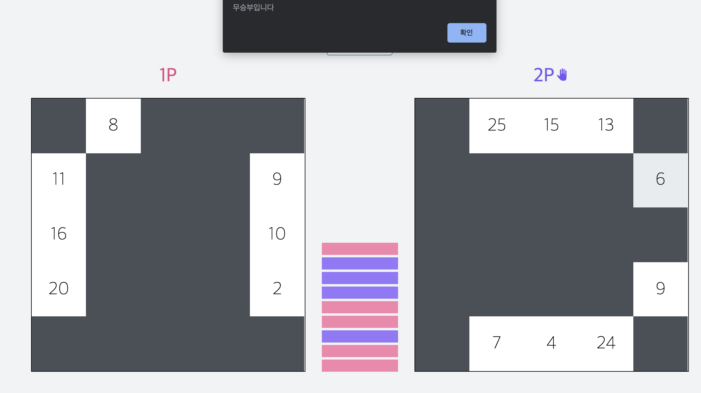

https://whatcha-bingo.herokuapp.com/

# Simple 2P bingo-game

### This project is inspired by the Atomic Design, used by hooks.

[Atomic Design](https://arc.js.org)

src

- components : functional-component only
  - atoms : most basic components (like Button, Icon)
  - molecules : a collection of atoms
  - organisms : a collection of molecules
  - templates : page layouts
- containers : class-component only
- lib : external library only (style, api, hoc, etc...)
- store : Redux store management only
